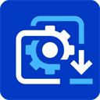

<div align="center">
  

  # WallHub

  **Discover, download, play, and convert Wallpaper Engine Workshop content in your browser.**

  [](https://github.com/ChEnLeo-7/WallHub2.0/releases)
  [](https://github.com/ChEnLeo-7/WallHub2.0/actions/workflows/release.yml)
  [](LICENSE)

  [](https://www.typescriptlang.org/)
  [](https://react.dev/)
  [](https://vite.dev/)
  [](https://tailwindcss.com/)
  [](package.json)
  [](https://www.docker.com/)

  [Download for Windows](https://github.com/ChEnLeo-7/WallHub2.0/releases) · [Quick Start](#quick-start) · [Usage](#usage) · [简体中文](README.md)
</div>

WallHub is a locally hosted manager for Wallpaper Engine Workshop content. It brings search, filters, item details, Steam login, download queues, video playback, and mobile MPKG conversion into one responsive web interface while keeping downloads, caches, and account sessions on your own device.

> [!NOTE]
> WallHub is not affiliated with, authorized by, or endorsed by Steam, Valve Corporation, Wallpaper Engine, or its developer Kristjan Skutta.

## Highlights

- **Search and filter**: Find items by keyword, Workshop item ID, author ID, or exact phrase, then filter by ranking, time range, type, age rating, genre, official tags, and resolution.
- **Rich item details**: View previews, authors, tags, statistics, descriptions, and comments. Subscribe, favorite, copy an item ID, or continue exploring by author and tag.
- **Controllable download queue**: See real progress, speed, and stages with concurrent downloads, pause, resume, cancellation, reordering, and local cache management.
- **Video playback**: Prefer local cached files or proxy remote video, use native or compatibility controls, and optionally try experimental SteamKit chunk streaming.
- **Mobile MPKG conversion**: Convert scene and video projects, download the result or keep it locally. Scene projects support fast and maximum-compression profiles while retaining `sounds/` audio.
- **Personal Steam content**: Sign in with a password, Steam Guard, or QR code to browse personal subscriptions, favorites, and other personal sources, then subscribe or favorite from item details.
- **Personalized interface**: Switch between Simplified Chinese and English, light/dark/system themes, accent colors, grid/list views, responsive column counts, and two detail layouts.
- **Network and runtime controls**: Configure the download directory, concurrency, proxy, Steam API key, DNS/Hosts, CDN, chunk cache, and experimental features.
- **Verified updates**: Check GitHub Releases and verify the SHA-256 values in the release description before updating Windows packages or cross-platform source installs. Docker can use a separate updater container with multi-platform GHCR images.

## Quick Start

### Windows (recommended)

Download a Windows x64 package from [GitHub Releases](https://github.com/ChEnLeo-7/WallHub2.0/releases):

| Package | Best for |
| --- | --- |
| `WallHub-Setup-win-x64.exe` | Guided installation and removal for regular use |
| `WallHub-Portable-win-x64.zip` | Extract and run `WallHub.exe` without installation |

Both packages include Node.js, Python, .NET, and the MPKG dependencies. WallHub runs in the notification area and opens `http://localhost:3090` automatically. Use the tray menu to open the app, root directory, or logs, set startup arguments, restart, or exit.

> [!TIP]
> Release descriptions list SHA-256 values at the bottom for integrity checks. Unsigned builds may trigger a Windows SmartScreen “unknown publisher” warning.

### Docker

Docker Engine and Docker Compose are required:

```bash
git clone https://github.com/ChEnLeo-7/WallHub2.0.git
cd WallHub2.0
docker compose up -d --build
```

Open `http://localhost:3090`. Container data is stored in `./wallhub-data` by default. Check status, follow logs, or stop the service with:

```bash
docker compose ps
docker compose logs -f wallhub
docker compose down
```

Set `WALLHUB_PORT` to change the host port, for example `WALLHUB_PORT=8080 docker compose up -d --build`.

Enable automatic Docker updates with:

```bash
WALLHUB_DOCKER_AUTO_UPDATE=1 docker compose --profile auto-update up -d
```

The updater periodically pulls `ghcr.io/chenleo-7/wallhub:latest`. It is the only service with Docker Socket access; the WallHub application container receives no Docker host privileges. Docker Socket access grants full control of the host Docker Engine, so enable this profile only if that privilege boundary is acceptable.

When Watchtower recreates the container, it preserves the environment variables, ports, volumes, restart policy, labels, hostname, and command that are active on the current container. It does not edit the user's `docker-compose.yml`. Compose changes that have been saved but not applied with `docker compose up -d` are not included in that recreation. Keep persistent files in the `/data` volume instead of relying on the container writable layer or locally modified image layers.

### Run From Source

The full feature set is designed for the following environment:

- Node.js 16.17 or later
- Python 3.11
- .NET 9 SDK/Runtime
- `curl`, `unzip`, and `zip`

```bash
git clone https://github.com/ChEnLeo-7/WallHub2.0.git
cd WallHub2.0
python -m pip install -r tools/mpkg/requirements.txt
npm ci
npm run build:ui
npm start
```

Open `http://localhost:3090`. Preparing the SteamKit runtimes may take a while the first time you use Steam download or playback features.

## Usage

1. Open WallHub and browse the Workshop with a keyword, item ID, author ID, or filters.
2. Check the download directory, concurrency, and network options in Settings. Safe content mode is enabled by default.
3. Before downloading, subscribing, or opening personal content, sign in to Steam with a password, Steam Guard, or QR code.
4. Choose immediate download, background download, video playback, or MPKG conversion from a card or item details.
5. Track and control work in the queue. Downloaded videos can play locally, and cached items can be exported again.

> [!IMPORTANT]
> Workshop downloads normally require a Steam account that legitimately owns Wallpaper Engine (Steam App `431960`). Steam sessions are stored in the local `SteamKit` data directory; protect it as you would any other account credential.

### Mature Content Mode

WallHub hides mature-content options by default. Enable them only when they are appropriate for your environment and local rules:

```bash
npm run start:nsfw
```

For Windows packages, add `--NSFW` through “Startup arguments” in the tray menu. For Docker, change the Compose `command` to `['node', 'server.js', '--NSFW']`. Safe mode relies on Workshop tag filtering and is not an absolute content-safety guarantee.

## Data And Security

| Runtime | Default data location |
| --- | --- |
| Windows installer | `%LOCALAPPDATA%\WallHub2.0`, configurable during setup |
| Windows portable | The extracted WallHub root directory |
| Docker | `./wallhub-data` in the repository, mounted at `/data` |
| Source | `Downloads/`, `SteamKit/`, and `cache-settings.json` in the repository |

Windows upgrades preserve downloads, account sessions, settings, and logs. Uninstalling preserves data by default; the entire installation root is removed only when data cleanup is explicitly selected. Exit WallHub before backup or migration to avoid copying files while they are being written.

> [!CAUTION]
> WallHub listens on `0.0.0.0:3090` by default and does not provide its own access authentication. Use it only on a trusted device or trusted LAN, or place it behind an authenticated reverse proxy. Do not expose the port directly to the public internet.

### Application Updates

WallHub periodically checks the latest GitHub Release but does not overwrite the application without permission. Use “Settings → Server” to check, download, and install manually, or explicitly enable automatic updates. Packages are verified with SHA-256 and applied by a separate process after the service exits; downloads, Steam sessions, settings, and logs are preserved. See [Update mechanism](docs/updates.md) for platform behavior and the release asset contract.

## Development

The backend uses Node.js CommonJS. The React/TypeScript frontend is built with Vite into the committed `public/` directory. The main directories are:

```text
frontend/src/       React UI, components, hooks, and client utilities
src/app/            HTTP lifecycle and routing
src/domains/        Workshop, SteamKit, downloads, video, and MPKG logic
src/infrastructure/ Process, network, and archive adapters
src/shared/         Utilities shared across the application
tools/              MPKG, Windows packaging, and maintenance scripts
docs/               Design and operational documentation
```

Keep the backend running while using the frontend development server:

```bash
npm start       # Backend and built UI: http://localhost:3090
npm run dev:ui  # Vite development server: http://localhost:5173
```

Run these checks before submitting a change:

```bash
npm test
npx tsc --noEmit
npm run build:ui
python -m unittest tools/mpkg/test_mobile_mpkg.py
```

Windows packaging requires Windows x64, PowerShell, Python 3.11, the .NET 9 SDK, and Inno Setup 6. See the [Windows packaging guide](docs/windows-packaging.md).

## Troubleshooting

### The Page Does Not Open

Confirm that the process is still running and that port `3090` is available. Docker users can run `docker compose ps` and `docker compose logs -f wallhub`.

### Steam Login Succeeds but Downloads Do Not Start

Confirm that the account owns Wallpaper Engine, then check Steam access diagnostics, proxy, DNS/Hosts, and system time. Downloads cannot start while Steam Guard or mobile confirmation is incomplete.

### MPKG Conversion Is Unavailable

Windows packages and the Docker image include conversion dependencies. When running from source, verify that the Python requirements installed successfully. If maximum compression is unavailable, WallHub falls back to the fast profile.

### Still Stuck

Check [GitHub Issues](https://github.com/ChEnLeo-7/WallHub2.0/issues) for an existing report. When troubleshooting, record your platform, WallHub version, reproduction steps, and relevant redacted logs. Never disclose Steam credentials, cookies, or API keys.

## References And Thanks

WallHub is built with [SteamKit2](https://github.com/SteamRE/SteamKit), [DepotDownloader](https://github.com/SteamRE/DepotDownloader), [React](https://react.dev/), [Vite](https://vite.dev/), and [Node.js](https://nodejs.org/). Thanks to the creators in the Wallpaper Engine and Steam Workshop communities, and to every maintainer and contributor behind its open-source dependencies.

## Disclaimer

WallHub is intended for personal learning, research, and local content management. It does not provide or host Workshop content. Copyright, licensing, and usage restrictions remain with the original authors or rights holders. Users must follow Steam and Wallpaper Engine terms, Workshop content licences, and applicable laws, and must not redistribute content unlawfully or use it commercially without authorization. The software is provided “as is” under the [MIT License](LICENSE); users are responsible for account security, compliance, and all risks arising from use.
